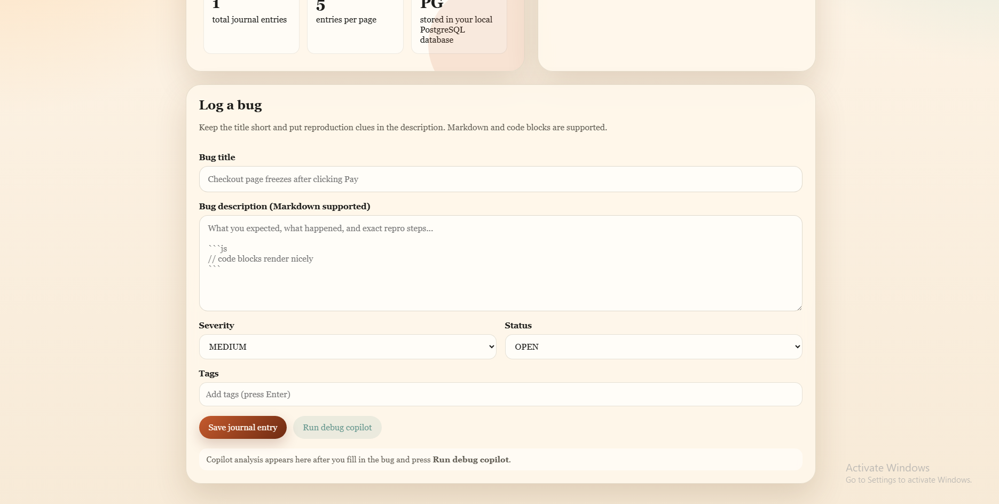
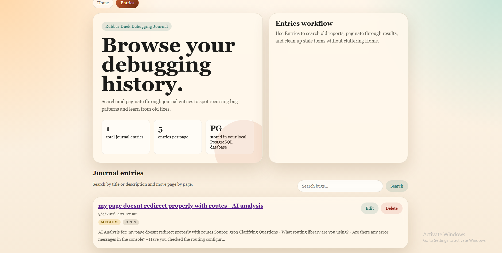

# Rubber Duck Debugging Journal

A full-stack debugging journal that helps developers think through bugs systematically. Log your bugs, get AI-powered copilot analysis with root causes, debug plans, fixes, and tests — all in one place.

**Live:** https://duck-neon-pi.vercel.app

**GitHub:** https://github.com/rafeyansari36/duck

## Features

- **Bug Logging** — Create, edit, and track bug entries with title, description, severity, status, resolution, and tags
- **AI Debug Copilot** — Get AI-generated analysis including likely root causes, step-by-step debug plans, suggested fixes, and test recommendations (powered by Groq)
- **Entries Journal** — Browse, search, and paginate through all your logged bugs
- **Detail & Edit Views** — View full bug details with Markdown rendering, edit entries anytime
- **Copy & Save Analysis** — Copy AI analysis to clipboard or save it as a separate journal entry
- **Markdown Support** — Write bug descriptions and view analysis with full Markdown and code block support

## Tech Stack

| Layer    | Technology                          |
| -------- | ----------------------------------- |
| Frontend | React 19, TypeScript, Vite          |
| Backend  | Spring Boot 3.5, Java 17            |
| Database | PostgreSQL                           |
| AI       | Groq API                            |
| Hosting  | Vercel (frontend), Render (backend) |

## Project Structure

```
rspj-app/
├── frontend/          React + Vite app
│   └── src/
│       ├── pages/     HomePage, EntriesPage, BugDetailPage, BugEditPage
│       └── components/ Hero, BugForm, BugCard, BugList, AnalysisPanel, etc.
└── backend/           Spring Boot REST API
    └── src/main/java/com/rspj/backend/
        ├── bug/       BugEntry CRUD (controller, service, repository, DTOs)
        ├── duck/      AI analysis (Groq integration, request/response models)
        ├── config/    CORS configuration
        └── common/    Global error handling
```

## Getting Started

### Prerequisites

- Java 17+
- Node.js 18+
- PostgreSQL 17+

### Backend

```bash
cd backend
./mvnw spring-boot:run
```

The API starts on `http://localhost:8080`.

### Frontend

```bash
cd frontend
npm install
npm run dev
```

The app starts on `http://localhost:5173`.

## Screenshots

### Home — Log a bug & run AI debug copilot


### Entries — Browse your debugging history


## License

MIT
